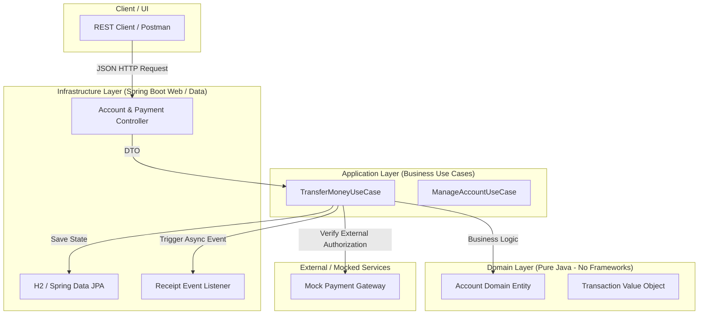

# pgapi
Core Ledger &amp; Payment Gateway API


```mermaid
graph TD
    subgraph ui ["Client / UI"]
        Postman[REST Client / Postman]
    end

    subgraph infra ["Infrastructure Layer (Spring Boot Web / Data)"]
        Controller[Account & Payment Controller]
        JPA[H2 / Spring Data JPA]
        EventListener[Receipt Event Listener]
    end

    subgraph app ["Application Layer (Business Use Cases)"]
        TransferUseCase[TransferMoneyUseCase]
        AccountUseCase[ManageAccountUseCase]
    end

    subgraph dom ["Domain Layer (Pure Java - No Frameworks)"]
        AccountEntity[Account Domain Entity]
        TransactionEntity[Transaction Value Object]
    end

    subgraph ext ["External / Mocked Services"]
        MockGateway[Mock Payment Gateway]
    end

    %% Data Flow
    Postman -->|JSON HTTP Request| Controller
    Controller -->|DTO| TransferUseCase
    TransferUseCase -->|Business Logic| AccountEntity
    TransferUseCase -->|Save State| JPA
    TransferUseCase -->|Trigger Async Event| EventListener
    TransferUseCase -->|Verify External Authorization| MockGateway
```

```
